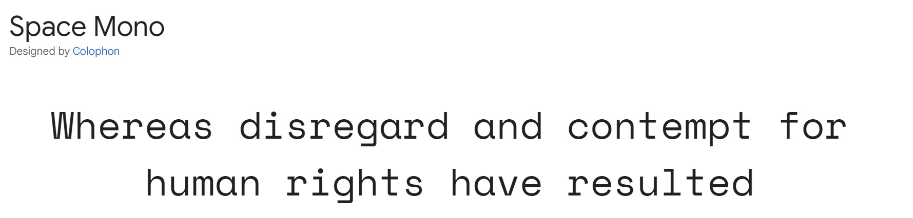
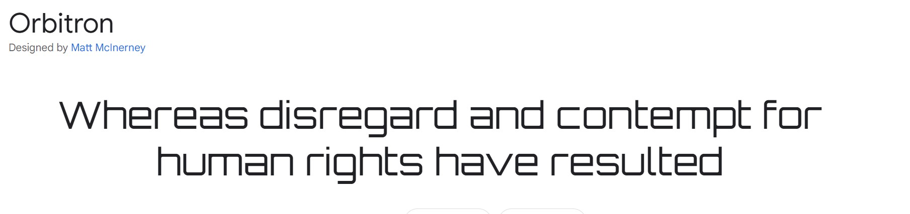
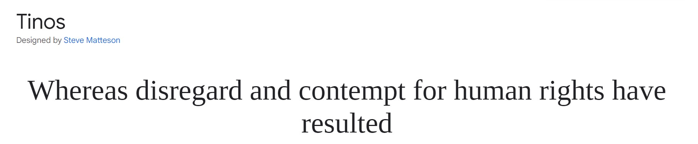

# CryptoSwap 

CryptoSwap is a cryptocurrency converter that allows users to easily convert popular digital currencies such as Bitcoin, Ethereum, and Litecoin into fiat currencies like USD, EUR, and GBP. The user-friendly interface makes it simple for anyone to quickly calculate the value of their digital assets. CryptoSwap is a project as part of the milestone project 2 for Code Institute, developed by a student with a passion for the rapidly growing world of cryptocurrency.

(Add multidevice screenshot here)

## Demo

View the website here (to be added)

## Table of contents

* [User Experience](#User-Experience-UX)
  * [User Stories](#User-Stories)

* [Design](#Design)
  * [Colour Scheme](#Colour-Scheme)
  * [Typography](#Typography)
  * [Imagery](#Imagery)
  * [Wireframes](#Wireframes)
  * [Features](#Features)
    * [The Home Page](#The-Home-Page)
    * [Future Implementations](#Future-Implementations)
  * [Accessibility](#Accessibility)

* [Technologies Used](#Technology)
  * [Languages Used](#Languages-Used)
  * [Frameworks, Libraries & Programs Used](#Frameworks,-Libraries-&-Programs-Used)

* [Deployment & Local Development](#Deployment-&-Local-Development)
  * [Deployment](#Deployment)
  * [Local Development](#Local-Development)
    * [How to Fork](#How-to-Fork)
    * [How to Clone](#How-to-Clone)

* [Testing](#Testing)
  * [Fixed Bugs](#Fixed-Bugs)
  * [Test Cases](#test-cases)
  
* [Credits](#Credits)
  * [Code Used](#code-credits)
  * [Acknowledgments](#Acknowledgments)

## User Experience UX

### Key information for the site:

   1. Real-time conversion rates for various digital assets, such as Bitcoin, Ethereum, and Litecoin.

   2. The ability to display the converted value in multiple fiat currencies, such as USD, EUR, and GBP.

   3. A "reset" button for users to easily clear the converted amount.

   4. Links to external resources for buying and selling cryptocurrencies, such as exchanges or peer-to-peer platforms.

   5. Data on the total market capitalization of different digital assets, updated in real-time (external source).

   6. Educational resources for users who are new to cryptocurrencies, such as articles or videos (external) that explain how they work and how to safely buy and sell them.

   7. Historical data on the price of different digital assets, allowing users to view trends and make informed decisions.

   8. A user-friendly interface that is easy to navigate and understand.

### User Stories

   * As a new user, I want to be able to understand how the website works, so that I can easily convert the value of my digital assets.

   * As a frequent user, I want to be able to see the real-time conversion rates of multiple digital assets, so that I can make informed decisions about my investments.

   * As a user who frequently travels, I want to be able to see the converted value of my digital assets in multiple fiat currencies, so that I can understand their value in different countries.

   * As a user who is new to buying and selling cryptocurrencies, I want to be able to access educational resources on the website, so that I can learn more about the process.

   * As a user who is interested in the overall market trends, I want to be able to see the total market capitalization of different digital assets, so that I can understand the bigger picture.

   * As a user who wants to buy or sell cryptocurrencies, I want to be able to access external resources from the website, so that I can find the best platforms to do so.

   * As a user who wants to stay updated on the latest news and trends, I want to be able to access the website's social media profiles, so that I can stay informed.

   * As a user who values convenience, I want to be able to reset the converted amount with a single click, so that I can easily enter new values without having to manually clear the field.

### User Goals

#### Client goals:

   * To provide an easy-to-use and accurate tool for converting the value of digital assets into fiat currency.

   * To allow the users to easily navigate the website by designing a readable color pallette, intuitive design, and a "Back to Top" button to easily return to the top of the page.  

   * To attract and retain users by providing real-time conversion rates and market capitalization data for multiple digital assets.

   * To educate users who are new to cryptocurrencies by providing access to educational resources and external links.

   * To increase user engagement by providing social media integration and historical data analysis.

   * To provide a secure external platform for users to manage their digital assets and perform transactions.

   * To increase sales and revenue by providing external links to buy and sell cryptocurrencies.

   * To establish trust and credibility by providing a reliable, accurate and up-to-date information to the users.

#### First-Time Visitor Goals:

   * Convert value of a cryptocurrency to fiat currency.

   * Learn the basics of cryptocurrency and blockchain technology through the educational resources provided on the site.

   * Access external resources to buy, view capitalisation, and educate  about crypto.

   * To be able to access CryptoSwap's social media.

   *  To be able to contact CryptoSwap.

#### Returning Visitor Goals:

   * Monitor the real-time value of their digital asset portfolio and track its performance over time.

#### Frequent Visitor Goals:

   * Stay ahead of the market trends by constantly monitoring the real-time value of their digital asset portfolio and tracking its performance over time.

   * Make informed investment decisions by utilizing the site's educational resources, real-time market data, and built-in calculator to evaluate their investment strategy and identify new opportunities.

- - - 

## Design

### Colour Scheme

### Typography 

Google Fonts was used for the following fonts:

  * Space Mono is used for all text in the webpage, making it the primary font. It's a modern font that provides a clean and legible look for the text, making it easy to read.
     
  * Times New Roman is used for label elements, such as form labels, it is a classic font, It is a serif font, which is traditionally used for printed materials and it help to add an extra touch of elegance and sophistication to the page.

  * Orbitron is used for headings, it is a font that is designed to attract attention, it is a sans-serif font with a futuristic feel. This font is used to highlight important information and make it stand out on the page, it helps to create a visual hierarchy by making headings more prominent than the body text.

### imagery

No images present.

### Wireframes

Wireframes were created for desktop and mobile view. They were made to help me visualise the layout of the website before it was finished and make any tweaks easier. 

- Desktop
  - Navbar + converter - [View](docs/wireframes/Desktop%201.jpg)
  - Content + footer - [View](docs/wireframes/Desktop%202.jpg)
- Mobile
  - The whole page on iPhone 14 plus - [View](docs/wireframes/mobile-wireframes.jpg)

### Features

#### The Home Page

#### Future Implementations

### Accessibility

It was ensured that the website is accessible and as user-friendly as possible. I have achieved this by: 

- - -

## Technology

### Languages Used

 HTML, CSS and JavaScript were used for this project.

### Frameworks, Libraries & Programs Used

* Figma - Wireframes.

* Git - Version control.

* GitHub - To save and store the files for the website.

* Google Fonts - To import the fonts used on the website.

* Font Awesome - For the iconography on the website.

* Google Dev Tools - Troubleshooting, testing features and solving issues with responsiveness and styling.

* [Am I Responsive?](http://ami.responsivedesign.is/) To show the website image on a range of devices.
* [Favicon.io](https://favicon.io/) To create favicon.

- - -

## Testing

Testing progressed at every stage of this project. This ensured that most issues were fixed before the website was finished. Chrome DevTools were utilised when building the website to help with troubleshooting as the website transformed. 

The following issues were raised during my project meeting with my mentor:

*

### W3C Validator

The W3C validator was used to validate the HTML and CSS pages.

### Fixed Bugs

1. The Fontawesome icons did not render properly when wrappen in an achor element. I fixed this by wrapping them in a button instead and utilising JavaScript to make sure each button leads to the correct source. 

### Test Cases

I have fully tested the website using Google Chrome and Mozilla Firefox on desktop (HP Pavilion Convertible 14 inch) and mobile (Samsung Note9). 

It was ensured that through the testing process content was responsive using the Google Developer Tools. 

#### Home page

- - -

## Deployment & Local Development

### Deployment

GitHub Pages was used to deploy the live website. Instructions:

1. Log in (or sign up) to Github.
2. Find the repository for this project, "First-milestone-project-DroneX".
3. Click on the Settings link.
4. Click on the Pages link in the left-hand side navigation bar.
5. In the Source section, choose main from the drop-down select branch menu. Select Root from the drop-down select folder menu.
6. Click Save. Your live Github Pages site is now deployed at the URL shown.

### Local Development

#### How to Fork

Fork the CryptoSwap repository:

1. Log in (or sign up) to Github.
2. Go to the repository for this project, adampl12/CryptoSwap.
3. Click the Fork button in the top right corner.

#### How to Clone

Clone the CryptoSwap repository:

1. Log in (or sign up) to GitHub.
2. Go to the repository for this project, adampl12/CryptoSwap.
3. Click on the code button, select whether you would like to clone with HTTPS, SSH or GitHub CLI and copy the link shown.
4. Open the terminal in your code editor and change the current working directory to the location you want to use for the cloned directory.
5. Type 'git clone' into the terminal and then paste the link you copied in step 3. Press enter.

- - -

## Credits

### Code Credits

* [HopeUI](https://www.instagram.com/hopeui.io/) - NavBar and its responsiveness.

- - -

## Acknowledgements