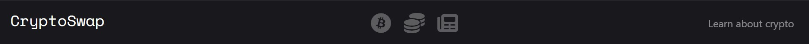

# CryptoSwap

Stay informed on cryptocurrency trends with CryptoSwap, a simple platform for live pricing information. View up-to-date values for six popular cryptocurrencies, displayed in euros for ease of use.

**New Feature** Convert any Bitcoin amount to Euros (EUR)!

Developed as part of a milestone project 2 for Code Institute, CryptoSwap offers a compact resource for crypto enthusiasts and those looking to learn more. Get a glimpse into the dynamic world of cryptocurrency with CryptoSwap.

  

[View the deployed website here](https://adampl2.github.io/CryptoSwap/)

## Table of contents

* [`User Experience`](#user-experience-ux)
  * [`User Stories`](#user-stories)

* [`Design`](#design)
  * [`Colour Scheme`](#colour-scheme)
  * [`Typography`](#typography)
  * [`Imagery`](#imagery)
  * [`Wireframes`](#wireframes)
  * [`Features`](#features)
    * [`The Home Page`](#the-home-page)
    * [`Future Implementations`](#future-implementations)
  * [`Accessibility`](#accessibility)

* [`Technologies Used`](#technology)
  * [`Languages Used`](#languages-used)
  * [`Frameworks, Libraries & Programs Used`](#frameworks--programs-used)

* [`Deployment & Local Development`](#deployment--local-development)
  * [`Deployment`](#deployment)
  * [`Local Development`](#local-development)
    * [`How to Fork`](#how-to-fork)
    * [`How to Clone`](#how-to-clone)

* [`Testing`](#testing)
  * [`Fixed Bugs`](#fixed-bugs)
  
* [`Credits`](#credits)
  * [`Code Used`](#code-credits)
  * [`Acknowledgments`](#acknowledgements)

## User Experience (UX)

### Key information for the site

1. Live cryptocurrency pricing: Display real-time values for 6 popular cryptocurrencies (BTC, ETH, BNB, XRP, ADA, and LTC) in euros (EUR)

2. Educational resources: Provide information and resources to educate users about the blockchain and crypto in general.

3. User-friendly interface: Offer an easy-to-use interface for users to view cryptocurrency prices and access educational content.

4. External sources: Allow users to access external sources for buying cryptocurrency, viewing CoinMarketCap, and reading CoinDesk news.

5. Contact us: Provide a way for users to reach out with questions or feedback through an email address and physical address (Note: Address and email are fictional, for visual representation only).

6. Convert Your Crypto: Provide a feature where user can enter any amount of BTC they wish and convert it to EUR.

### User Stories

  1. First-time user: As a newcomer to the crypto world, I want a user-friendly platform that provides live pricing information and educational resources so that I can learn about cryptocurrency and track market trends.

  2. Returning user: As a regular user of the website, I want to be able to easily access live pricing information, external sources, convert my crypto, and access news updates so that I can stay informed and make informed decisions about my investments. I also want to have the ability to contact the team for support if needed.

### User Goals

#### Client goals

1. Access to real-time pricing information: The client wants to be able to view live prices of popular cryptocurrencies in euros to track market trends and make informed investment decisions.

2. Educational resources: The client wants to have access to educational resources and information about the blockchain and crypto in general to expand their knowledge and stay informed.

3. Convenient and user-friendly platform: The client wants a user-friendly platform that offers a comprehensive and convenient one-stop destination for all things cryptocurrency, including external sources for buying, CoinMarketCap, CoinDesk news, and a way to contact the team for support.

4. Ability to convert Bitcoin: The client wants to convert any amount of BTC to EUR they wish and receive up-to-date price in valid currency.

#### First-Time Visitor Goals

   1. Understanding of cryptocurrency: The first-time user wants to gain a basic understanding of cryptocurrency and the blockchain through educational resources and information provided on the website.

   2. Live pricing information: The first-time user wants to be able to view live prices of popular cryptocurrencies in euros to stay informed on market trends and make informed investment decisions.

   3. User-friendly platform: The first-time user wants a user-friendly platform that is easy to navigate and understand, allowing them to quickly access the information and resources they need to learn about cryptocurrency

#### Returning Visitor Goals

   1. Quick access to updated information: The returning visitor wants to easily access updated live pricing information and news updates to stay informed on market trends and make informed investment decisions.

   2. Convenient access to all resources: The returning visitor wants a comprehensive and convenient platform that provides access to all necessary information, including external sources for buying, CoinMarketCap, CoinDesk news, and a way to contact the team for support. The returning visitor wants the platform to be user-friendly and easy to navigate, allowing them to quickly access the information and resources they need.

#### Frequent Visitor Goals

   1. Timely access to market updates: The frequent visitor wants quick access to updated live pricing information and news updates so that they can stay informed on market trends and make informed investment decisions.

   2. Efficient use of platform: The frequent visitor wants a platform that is user-friendly and efficient, allowing them to quickly access the information and resources they need, including live pricing information, educational resources, external sources, CoinMarketCap, CoinDesk news, and a way to contact the team for support. The frequent visitor wants the platform to be easy to navigate and understand, allowing them to make the most of their time.

- - -

## Design

### Colour Scheme

The Navbar and footer both have the same shade of black to make them distinguishable from the white background of the page. This has been done to create a visually pleasing & healthy contrast between contents of the page and background colour.

The main "Track Live Prices" container and texts inside "Learn more about crypto", "Convert Your Bitcoin", and "Definitions" all have a light yellow colour that has been adapted from binance.com to improve readability of the contents and create an eye-pleasing colour contrast.

* Navbar, footer (background), all headings and span elements inside tabs (text) have `#19191C` as their colour.

* Except for Logo `(#FFF)` and social media icons `(blue)`, buttons and all text on navbar and footer elements have a `#F9F9F9` colour.

* Containers have a `#FFFDE6` colour as their backgrounds.

* Paragraphs inside containers have a `#333` colour.

   

### Typography

Google Fonts was used for the following fonts:

* **IBM Plex Sans** is used as a main text in the webpage, making it the primary font. It's a modern font that provides a clean and legible look for the text, making it easy to read.

* **Space Mono** font is used as a logo font to help distinguish the logo from the rest of the text & make it attention-grabbing.

* **Asap** font is used as a h4 to display each crypto name in the .main container. It is a sans serif font that is designed to be legible and highly readable, making it ideal for use in headings and titles. The Asap font could help ensure that the names of different cryptocurrencies are clearly distinguishable and easy to read, even when the prices are rapidly changing. This can help make the information more accessible and usable for users who are tracking the price of different cryptocurrencies.

* **Crimson Text** font is used to display the price, more specifically, the live (changing) numbers. I chose this font because it has a clear, clean, and legible typeface, making it ideal for displaying numbers. The font's design features crisp, distinctive numerals, which make it easy for readers to quickly identify and distinguish between numbers.

### imagery

The only `img` elements user are the loading GIF that disappear when crypto price is loaded.

### Wireframes

Wireframes were created for desktop and mobile view. They were made to help me visualize the layout of the website before it was finished and make any tweaks easier.

* Desktop
  * Navbar + converter - [View](docs/wireframes/Desktop%201.jpg)
  * Content + footer - [View](docs/wireframes/Desktop%202.jpg)
* Mobile
  * The whole page on iPhone 14 plus - [View](docs/wireframes/mobile-wireframes.jpg)

## Features

### The Home Page

The page only consists of the Home page where all features and content are present & responsive.

* The browser tab & favicon:

  

* The navbar (from left) consists of a logo (refreshes the page), 3 buttons that lead to binance.com, coinmarketcap and coindesk. It also has a *Learn about crypto* that leads to a corresponding link on the page and is only visible on desktop and some iPads, for example iPad Air.

  

* The Track Live Prices section allows user to view up-to-date pricing of 6 popular cryptocurrencies.

  

* The Convert Your Bitcoin feature lets the user to enter any BTC amount up to 9 characters and view that converted amount in Euro (EUR). There is no need to click any button (as it does not exist) or press ENTER, the amount in EUR will update automatically as BTC amount in input field is changed by the user.

  

* The Learn About Crypto section consists of 6 interactive tabs. Each tab contains a heading, text and "Read more..." button. Once clicked - reveals more text and changes its form to "Read less..."

  

   After the button is clicked:

   

* The Definitions section consists of 3 short definitions.

  

* The footer section has 3 columns - Logo and contact details (fictional), Education - 2 links leading to educational YouTube channels, 1 in English and 1 in Polish. Buy Crypto - Leading to 2 biggest crypto exchanges.

  

### Mobile

* navbar + Live prices - mobile view (Samsung Galaxy S20 Ultra)

  

* Convert BTC

  

* Learn About Crypto

  
  

* Definitions

  

* Footer

  

### Future Implementations

The following ideas & features to be potentially implemented in the future:

  1. More advanced error handling for handlePrice function: As the code currently stands, it provides some basic error handling by updating the inner text of the crypto HTML element to display error messages if the WebSocket connection is closed or if an error occurs. More robust error handling should be implemented, such as logging the errors or displaying them in a separate UI element.

  2. Caching: Store data for later use, for example, to display to the user the change in price since they visited the website. Additional storage and event listeners would have to be implemented.

  3. Back to Top button: This potential feature would allow the user to go back to the top of the webpage quickly - with a touch of a finger (or a click!).

  4. More fiat currencies: Allow the user to view live prices of crypto not just in euros, but to add an option for more, for example, USD, GBP, CHF and so on.

  5. Convert: Allow the user to convert all the displayed crypto into EUR, and perhaps more fiat currencies.

### Accessibility

It was ensured that the website is accessible and as user-friendly as possible. I have achieved this by:

* Using semantic HTML.
* Following heading hierarchy.
* Implementing *Tab* friendly navigation for links.
* Using hover effects on all buttons and links to inform the user they are hovering on a button.
* Complying with colour contrast guidelines (Aa).

- - -

## Technology

### Languages Used

 HTML, CSS and JavaScript were used for this project.

### Frameworks & Programs Used

* [Figma](https://www.figma.com/) For wireframes.

* [Git](https://git-scm.com/) As version control.

* [GitHub](https://github.com/) To save and store the files for the website.

* [GitPod](https://gitpod.io) IDE used to create the site.

* [Google Fonts](https://fonts.google.com/) To import the fonts used on the website.

* [Bootstrap](https://getbootstrap.com/) For style.css.

* [Font Awesome](https://fontawesome.com/) For the iconography on the website.

* [Google Dev Tools](https://developer.chrome.com/docs/devtools/) For troubleshooting, testing features and solving issues with responsiveness and styling.

* [Am I Responsive?](http://ami.responsivedesign.is/) To show the website image on a range of devices.

* [Binance websocket](https://github.com/binance/binance-spot-api-docs/blob/master/web-socket-streams.md) Used to provide live crypto data.

* [Favicon.io](https://favicon.io/) To create favicon.

* [icons8.com](https://icons8.com/preloaders/en/search/loading) To create loading GIF.

* [Crypto coins](https://www.npmjs.com/package/cryptocoins-icons) To generate Crypto Icons.

- - -

## Testing

Please refer to [TESTING.md](TESTING.md) file for full testing procedure.

### Fixed Bugs

1. The Fontawesome icons did not render properly when wrapped in an anchor element. I fixed this by wrapping them in a button instead and utilising JavaScript to make sure each button leads to the correct source.

2. The input field in the BTC/EUR convert section did not have a character limit, and did not inform the user that it must be a number & <= 21000000. Firstly, I have changed its type to `type="text"` which allowed me to specify max length using `maxlength="10"` attribute. Secondly, I added an *if* statement to the js file that informs the user that input must be a number and cannot be greater than 21000000.

3. In order to convert btc to eur, the live btc price must load first, therefore, when user entered btc amount in the input field before btc live price is visible, the EUR span element would display "NaN". This is not a good user experience, therefore, I decided to disable the btc input field until btc live price is loaded.

4. "onerror" and "onclose" fixes. I decided that it would be a better idea call handlePrice() each time there is an error to refresh the websocket automatically instead having to refresh the page.

- - -

## Deployment & Local Development

### Deployment

GitHub Pages was used to deploy the live [CryptoSwap](https://adampl2.github.io/CryptoSwap/index.html) website. Instructions:

1. Log in (or sign up) to Github.
2. Find the repository for this project, [adampl12/CryptoSwap](https://github.com/adampl2/CryptoSwap).
3. Click on the Settings link.
4. Click on the Pages link in the left-hand side navigation bar.
5. In the Source section, choose main from the drop-down select branch menu. Select Root from the drop-down select folder menu.
6. Click Save. Your live Github Pages site is now deployed at the URL shown.

### Local Development

#### How to Fork

Fork the CryptoSwap repository:

1. Log in (or sign up) to Github.
2. Go to the repository for this project, [adampl12/CryptoSwap](https://github.com/adampl2/CryptoSwap).
3. Click the Fork button in the top right corner.

#### How to Clone

Clone the CryptoSwap repository:

1. Log in (or sign up) to GitHub.
2. Go to the repository for this project, [adampl12/CryptoSwap](https://github.com/adampl2/CryptoSwap).
3. Click on the code button, select whether you would like to clone with HTTPS, SSH or GitHub CLI and copy the link shown.
4. Open the terminal in your code editor and change the current working directory to the location you want to use for the cloned directory.
5. Type 'git clone' into the terminal and then paste the link you copied in step 3. Press enter.

- - -

## Credits

### Code Credits

* [HopeUI](https://www.instagram.com/hopeui.io/) - NavBar and its responsiveness.
* [W3schools](https://www.w3schools.com/howto/howto_js_tabs.asp) - Tabs to display different content on click event.
* [W3schools](https://www.w3schools.com/howto/howto_js_read_more.asp) - Read more button function.
* [Morgan Page](https://www.youtube.com/watch?v=XXuUNZIQUVA) - Connecting websocket.
* [Avinash Jain](https://stackoverflow.com/questions/18510845/maxlength-ignored-for-input-type-number-in-chrome) - Specifying max characters allowed in *Convert Your Bitcoin* input field.

- - -

## Acknowledgements

* [Rohit Sharma](https://github.com/rohit0286) - My Code Institute mentor.
