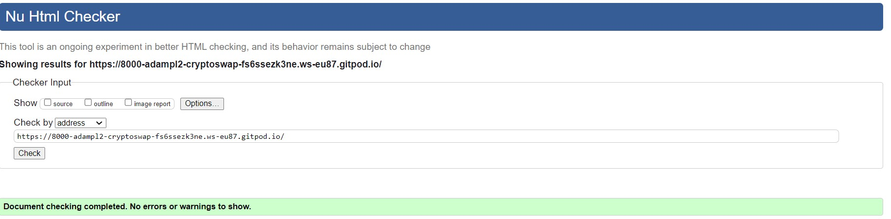
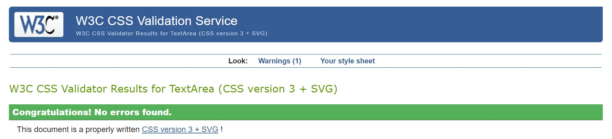
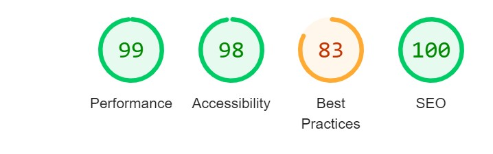
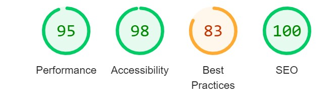

# CryptoSwap - Testing

[View deployed site here](https://adampl2.github.io/CryptoSwap/index.html)

- - -

## CONTENTS

* [`Automated Testing`](#automated-testing)
  * [`W3C Validator`](#w3c-validator)
  * [`JavaScript Validator`](#javascript-validator)
  * [`Lighthouse`](#lighthouse)
* [`Manual Testing`](#manual-testing)
  * [`User Stories`](#user-stories)
  * [`Full Testing`](#full-testing)

Testing progressed at every stage of this project. This ensured that most issues were fixed before the website was finished. Chrome DevTools were utilised when building the website to help with troubleshooting as the website transformed.

## Automated Testing

### W3C Validator

The [W3C validator](https://validator.w3.org/) was used to validate the HTML and CSS pages.

* HTML Validation

* CSS Validation

- - -

### JavaScript Validator

[jshint](https://jshint.com/) was used to validate all JavaScript code on this page.

* converter.js Validation

  * [`converter.js`](docs/converterjs-validation.jpg) - No errors, 24 warnings all relating to ES6 availability.

* main.js Validation

  * [`main.js`](docs/mainjs-validation.jpg) - No errors, 14 warnings all relating to ES6 availability.

- - -

### Lighthouse

Lower score on *Bad Practices* was mainly attributed to the loading image being low quality. I had to re-size it to fit its purpose, hence the lower quality.

### Desktop

### Mobile

- - -

## Manual Testing

### User Stories

`Client Goals`

| Goals | How are they achieved? |
| :--- | :--- |
| First-time user: As a newcomer to the crypto world, I want a user-friendly platform that provides live pricing information and educational resources so that I can learn about cryptocurrency and track market trends. | I have created a website that is easy to move around, provided live prices of 6 cryptocurrencies displayed in EUR and created a section where users can educate themselves about crypto | I want the site to be responsive to my device. | I have developed the site with responsiveness in mind. |
| Ability to convert Bitcoin: The client wants to convert any amount of BTC to EUR they wish and receive up-to-date price in valid currency. | I have created a section where users can convert BTC to EUR instantly. |

- - -

### Full Testing

I have fully tested the website using Google Chrome and Mozilla Firefox on desktop (HP Pavilion Convertible 14 inch) and mobile (Samsung Note9).

It was ensured that through the testing process content was responsive using the Google Developer Tools.

Further testing was performed by friends & family. No issues reported.

`Home Page`

| Feature | Expected Outcome | Testing Performed | Result | Pass/Fail |
| --- | --- | --- | --- | --- |
| The Logo | Link should refresh the page | Logo clicked | Home page reloads | Pass |
| *Buy Crypto!* button | Redirects user to external Binance page | Clicked on button | Binance page opens in a separate window | Pass |
| *Coinmarketcap* button | Redirects user to external Coinmarketcap page | Clicked on button | Coinmarketcap page opens in a separate window | Pass |
| *News* button | Redirects user to external Coindesk page | Clicked on button | Coindesk page opens in a separate window | Pass |
| *Learn about crypto* button | Redirects user to Learn about crypto section on the page | Clicked on button | User redirected to Learn about crypto section | Pass

`Home page - Convert Your Bitcoin`

| Feature | Expected Outcome | Testing Performed | Result | Pass/Fail |
| --- | --- | --- | --- | --- |
| Enter amount in BTC input | User should see converter amount in EUR | Any amount entered from 0 to 21,000,000 | BTC/EUR conversion | Pass |
| Enter amount in BTC input | User should see "Please enter only numeric values" message | Entered anything other than a Number | "Please enter only numeric values" message appears below in red | Pass |
| Enter amount in BTC input | User should see "The max limit is 21000000" message | Enter a number greater than 21,000,000BTC | "The max limit is 21000000" appears below in red| Pass |

`Home page - Learn About Crypto`

| Feature | Expected Outcome | Testing Performed | Result | Pass/Fail |
| --- | --- | --- | --- | --- |
| Crypto Tabs | A tab consisting of a description of each crypto & *Read less* button should appear below | Tab clicked | New content appears | Pass |
| *Read more* button | User should see expanded paragraph | Button clicked | Text expands | Pass |
| *Read less* button | Expanded paragraph should collapse back to its original shortened form | Button clicked | Expanded text disappears | Pass |

`Home page - Footer`

| Feature | Expected Outcome | Testing Performed | Result | Pass/Fail |
| --- | --- | --- | --- | --- |
| *Data Dash* button | Data Dash Youtube channel should open in a new window | Button clicked | Page opens in a separate window | Pass |
| *Phil Konieczny (PL)* button | Phil's Youtube channel should open in a new window | Button clicked | Page opens in a separate window | Pass |
| *Binance* button | Binance exchange should open in a new window | Button clicked | Page opens in a separate window | Pass |
| *Coindesk* button | Coindesk exchange should open in a new window | Button clicked | Page opens in a separate window | Pass |
| Facebook link | Facebook should open in a new window | Link clicked | Page opens in a separate window | Pass |
| Twitter link | Twitter should open in a new window | Link clicked | Page opens in a separate window | Pass |
| Instagram link | Instagram should open in a new window | Link clicked | Page opens in a separate window | Pass
